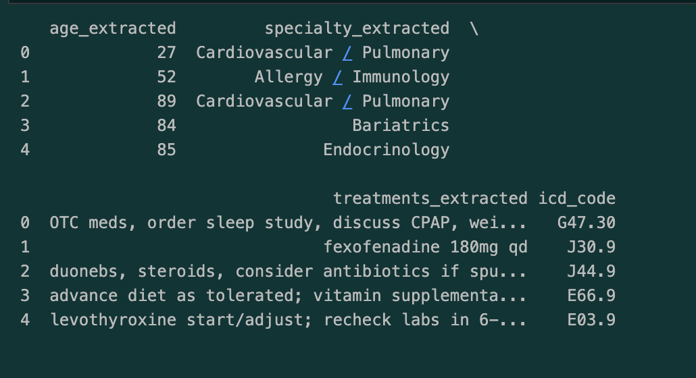
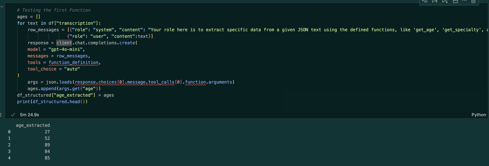

# Medical Transcript Structuring & ICD-10 Code Extraction using LLM Tool Calling

**Author**  
Sam Ginzburg  
📧 samginzee@gmail.com  

---

## **Business Problem and Motivation**

Medical professionals document patient encounters using free-text clinical transcriptions that include symptoms, diagnoses, procedures, and treatment plans. These notes are information-dense and often written in inconsistent, dictation-style formats, making structured extraction and downstream analysis challenging.

The goal of this project is to demonstrate how **large language models (LLMs) with tool calling (function calling)** can be used to automatically extract key medical information from unstructured clinical notes and infer corresponding **ICD-10-CM diagnosis codes**.

This workflow is directly applicable to:
- Medical documentation automation  
- Healthcare analytics  
- Insurance and billing support  
- Clinical decision-support pipelines  

---

## **Data Source**

This project was inspired by a guided learning exercise on **DataCamp** using anonymized medical transcription data categorized by medical specialty.

To respect licensing and redistribution constraints, the original dataset is **not included**. Instead, a **synthetic dataset** was generated to closely mirror:

- Original column structure (`medical_specialty`, `transcription`)
- Long, dictation-style clinical notes
- Inconsistent formatting and section headers
- Realistic clinical “noise” and variability

**Synthetic dataset used in this repository:**  
`data/synthetic_transcriptions_chaotic_v2.csv`

---

## **Methods / Skills Used**

This project demonstrates the following skills and techniques:

- **Python**
- **Pandas**
- **OpenAI API**
- **LLM Tool Calling (Function Calling)**
- **JSON Schema Design**
- **Unstructured Text Processing**
- **Schema-Constrained Data Extraction**
- **ICD-10-CM Code Inference**
- **Environment Variable Management**
- **Reproducible Notebook Workflows**

---

## **Results**

The pipeline produces a structured pandas DataFrame (`df_structured`) containing:

- Extracted patient age  
- Medical specialty labels  
- Extracted recommended treatment plans  
- Inferred ICD-10-CM diagnosis codes  

This demonstrates an **end-to-end transformation** from messy clinical text into machine-readable medical data suitable for operational use.

---

## **Quick Glance at Results**

**Structured output generated from unstructured clinical transcriptions:**



**Age and treatment plan extraction from free-text notes:**



---

## **How to Run This Project**

1. Clone the repository  
2. Install dependencies:
   ```bash
   pip install -r requirements.txt
3. Create an environment file:
   cp .env.example .env
4. Add your OpenAI API key to .env
5. Open and run:
  jupyter notebook notebooks/tool_calling_transcriptions.ipynb
  The .env file is excluded from version control.

## **Credit**
This project was completed with guidance from **DataCamp** and extended independently to include:
- Synthetic data generation for safe public sharing
- Tool-calling–based schema-constrained extraction
- ICD-10-CM inference logic
- End-to-end reproducibility and portfolio-grade presentation
